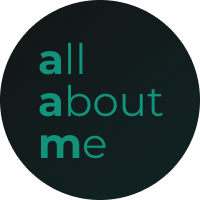

# React first Project

## React UI Base 파일모음

### 소개
분석 및 UX설계 단계 시 퍼블리셔(또는 프론트개발자)의 경우 UX 설계결과를 바탕으로  
보다 효율있는 구축/유지보수를 위한 UI 스타일링 및 컴포넌트화를 고민해야 한다. 
그러한 고민은 UX기획자, UI디자이너, 백 또는 프론트개발자와의 긴밀한 협조를 통해 이루어져야 한다. 
특히 특정 framework 또는 UI platform, library를 사용할 경우 그 기반에 맞는 UI 구현을 위해 많은 시간을 들인다.  

다양한 실무 프로젝트를 수행하면서 반복적인 UI/UX 설계 및 구현 과정에서 파편처럼 산재되어 있던 UI 구현 방식을 
체계적으로 관리하기 위해 파일 정리작업을 시작하였다. 
모든 파일은 data호출을 제외한 UI 구현을 목적으로 하고, Storybook으로 관리하여 산출물화 하였다. 

### 기술정보
        

### 작업기간
- 2026년 1월 ~ 3월 (예정)

### 작성자
jack  

